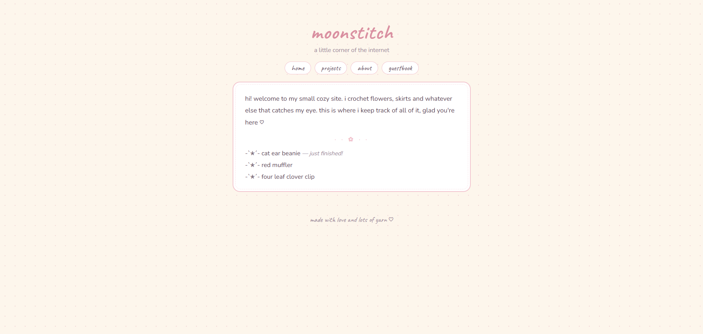
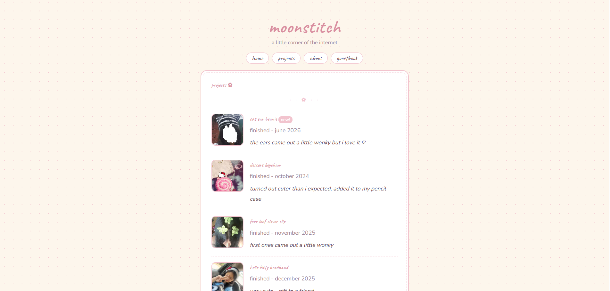
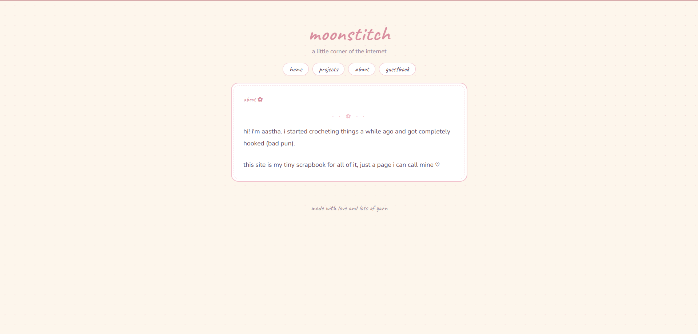

# moonstitch

Demo: https://khanaaaaaa.github.io/moonstitch/

## What It Is

A personal website I made to keep track of my crochet projects which is heavily inspired by personal neocities website kind of vibe.

## Why I Made It

Was just scrolling through TikTok and saw a girl suggesting fellow crocheters an app to keep track of her yarn, with a feature of keeping all your crochet projects' photos stored. That inspired me to make a personal website to store my projects and also make it cute.

## How I Made It

Tech Stack
- html
- css
- javascript

Just brainstormed a lot on what features I want. As it is a simple website, I just implemented simple HTML and CSS knowledge I have.

## What I Learnt & What I Struggled With

The biggest struggle ws the popup, I really struggled with the overlay, took a few tries. I also ran into a browser restriction with cursor image sizes (has to be under 128x128px) which I didn't know about before. Overall, it was really fun and I want to keep adding to it.

## Screenshots

